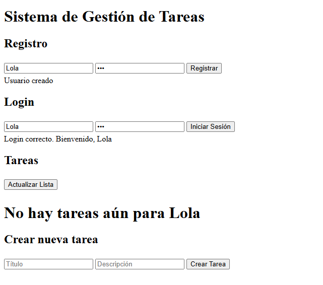
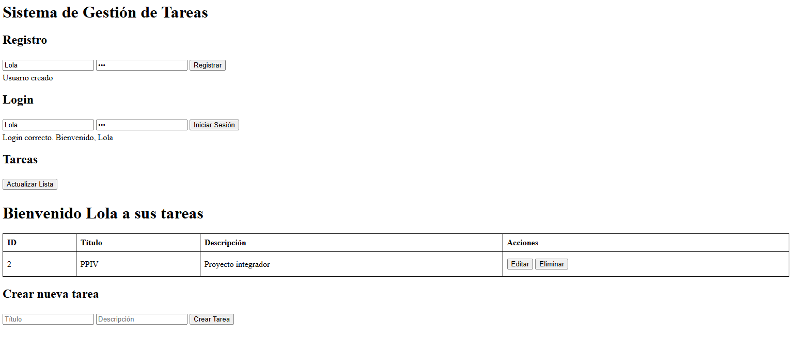
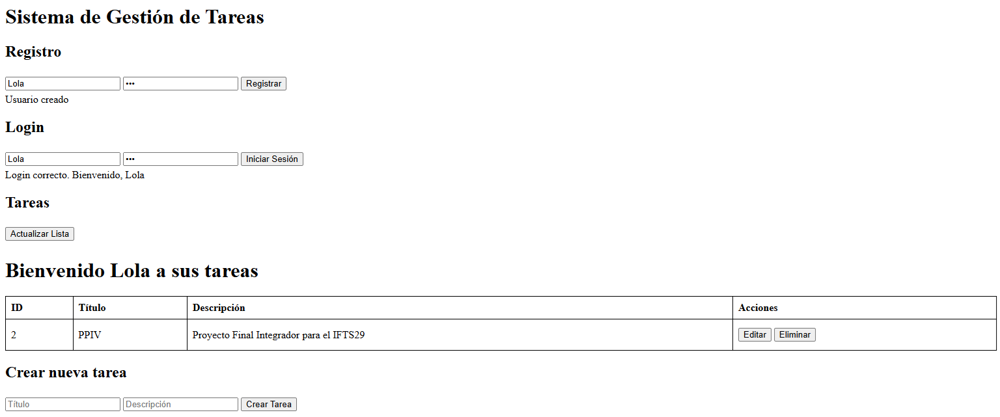
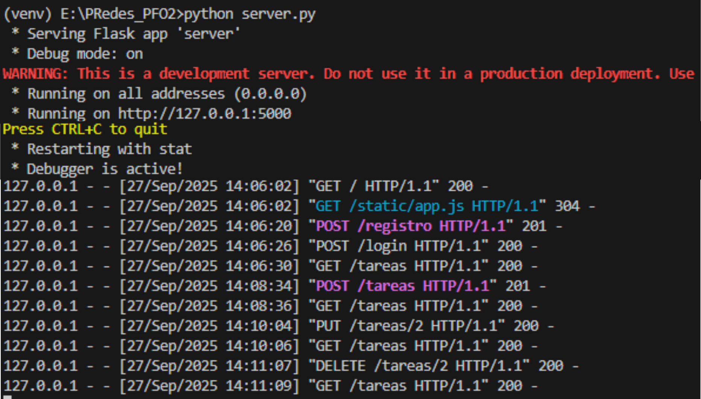
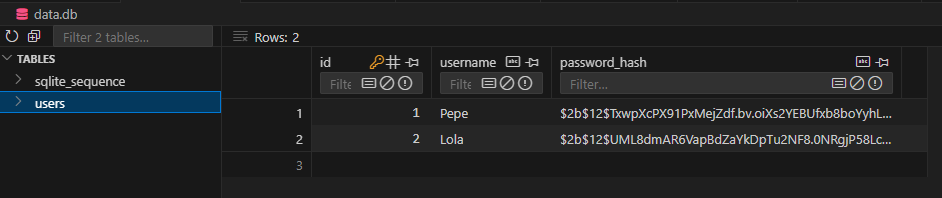
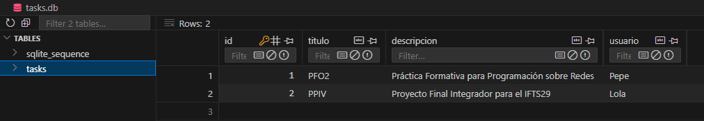

# PFO2 - Programación sobre Redes

## Sistema de Gestión de Tareas con API y Base de Datos

## Descripción
Este proyecto es una aplicación web y cliente de consola para **gestionar tareas**. Permite a los usuarios registrarse, iniciar sesión y realizar operaciones de **CRUD** (Crear, Leer, Editar, Eliminar) sobre sus tareas personales.  

La aplicación está construida con **Python, Flask y SQLite**, usando **autenticación básica** y una interfaz web dinámica con **JavaScript**. También incluye un cliente en consola que permite interactuar con la API de manera similar a la web.

---

## Tecnologías utilizadas

- Python 3.13.7
- Flask  
- Flask-Bcrypt  
- SQLite  
- HTML, CSS y JavaScript (fetch API)  
- Requests (para el cliente en consola)  

---

## Instalación

1. Clonar el repositorio:

```bash
git clone https://github.com/Pro-Piki/PRedes_PFO2.git
cd  PRedes_PFO2
```

2. Crear un entorno virtual:
```bash
python -m venv venv
```

3. Activar el entorno virtual:
- Windows
```bash
venv\Scripts\activate
```
- Linux/macOS:
```bash
source venv/bin/activate
```

4. Instalar dependencias:
```bash
pip install -r requirements.txt
```

---

## Usuarios y contraseñas para testeos

- Usuario: Pepe
- Contraseña: 123

- Usuario: Lola
- Contraseña: 456

---

## Uso WEB

1. Ejecutar el servidor:
```bash
python server.py
```

2. Abrir un navegador y acceder a: 
```bash
http://127.0.0.1:5000
```

3. Funcionalidades disponibles:
    - Registro de usuarios
    - Login
    - Ver tareas
    - Crear, editar y eliminar tareas

4. La interfaz web permite crear, modificar y eliminar tareas usando formularios y botones dinámicos.

---

## Uso desde consola

1. Ejecutar el cliente en una nueva terminal:
```bash
python client.py
```

2. Seguir las opciones del menú:

- El cliente utiliza autenticación básica para comunicarse con la API y permite realizar las mismas operaciones que la web, pero desde la consola.

```

=== Sistema de Gestión de Tareas ===
1. Registrar usuario
2. Login
3. Listar tareas
4. Crear tarea
5. Editar tarea
6. Eliminar tarea
7. Salir

```

---


## Endpoints de la API

| Método | Endpoint       | Descripción               | Autenticación |
| ------ | -------------- | ------------------------- | ------------- |
| POST   | `/registro`    | Crear un nuevo usuario    | No            |
| POST   | `/login`       | Iniciar sesión            | No            |
| GET    | `/tareas`      | Listar tareas del usuario | Sí (Basico)   |
| POST   | `/tareas`      | Crear nueva tarea         | Sí (Basico)   |
| PUT    | `/tareas/<id>` | Editar tarea existente    | Sí (Basico)   |
| DELETE | `/tareas/<id>` | Eliminar tarea existente  | Sí (Basico)   |

---

## Notas

- Las contraseñas se almacenan hashed con Flask-Bcrypt.

- La base de datos utilizada es SQLite (data.db para usuarios, tasks.db para tareas).

- Tanto la web como el cliente de consola usan autenticación básica, por lo que se recomienda usar HTTPS en entornos de producción.

---

## Capturas de la consola

- [Ver documentación completa](screenshot/Capturas_Consola.pdf)

---

## Capturas de la web

- Registro y Login de usuario sin tareas:



- Agregado de tarea: 



- Tarea editada



- Consola server ejecutado usando la api web



---

## Pruebas en Thunder Client

- [Ver documentación completa](screenshot/Capturas_Thunder_Client.pdf)

---

## Capturas de data.db y tasks.db





---

## Respuestas Conceptuales
### ¿Por qué hashear contraseñas?

Hashear contraseñas es una forma de protegerlas convirtiéndolas en un código irreconocible mediante una fórmula matemática. Esto se hace para que, aunque alguien acceda ilegalmente a la base de datos, no pueda ver ni usar las contraseñas reales. En lugar de guardar la contraseña tal cual, el sistema guarda solo su versión codificada (hash), que no se puede revertir fácilmente. Así, se cuida la privacidad del usuario y se evita que terceros puedan acceder a sus cuentas incluso si roban la información.

### Ventajas de usar SQLite en este proyecto

Usar SQLite en este proyecto tiene ventajas porque es ligero, fácil de configurar y no requiere un servidor separado, lo que permite guardar y consultar los datos de usuarios y tareas de manera rápida y sencilla, ideal para proyectos pequeños o de prueba.

---

- **Autor:** Yamila Yoshiko Matayoshi
- **Materia:** Programación sobre Redes 
- **Carrera:** Tecnicatura Superior en Desarrollo de Software IFTS29